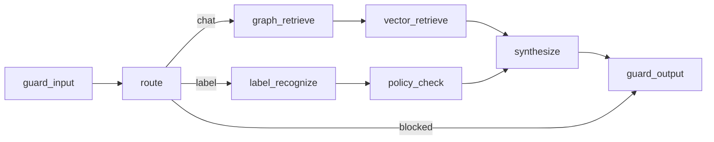

# C4 Level 3 — Компоненты агента

**Схема (Draw.io):** [c4-component.png](../../diagrams/c4-component.png) · [c4-component.drawio](../../diagrams/c4-component.drawio)

## Назначение

Внутреннее устройство оркестратора Knowledge Platform: Memory, Planner (route), Tools, Synthesizer, Guardrails — в духе требования курса к Agent Component view.

## Компоненты

| Компонент | Ответственность | Владение данными |
| --------- | --------------- | ---------------- |
| Memory (session / audit) | История сессии, audit decision | Postgres + in-memory audit |
| Planner / route | chat vs label vs blocked | State LangGraph |
| Tools | graph_retrieve, vector_retrieve, label_recognize, policy_check | Neo4j/Qdrant/MinIO mirror |
| Synthesizer | Генерация ответа через LLMClient | Промпт + citations |
| Guardrails | PII, injection, ACL leak check | Политика ролей |

Код: `backend/app/agent/graph.py`. Continuity: SRP из hw-3 (Policy Analyst → `policy_check`).
