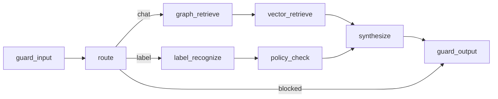

# C4 Level 3 — Agent Components

| Component | Responsibility |
|-----------|----------------|
| Memory (session/audit) | Postgres + in-memory audit trail |
| Planner / route | chat vs label vs blocked |
| Tools | graph_retrieve, vector_retrieve, label_recognize, policy_check |
| Synthesizer | LLM via OpenAI-compatible client |
| Guardrails | PII, injection, ACL leak check |