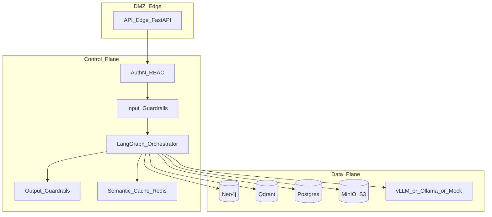

# C4 Level 2 — Containers

```mermaid
flowchart TB
  subgraph edge [DMZ_Edge]
    GW[API_Edge_FastAPI]
  end
  subgraph control [Control_Plane]
    Auth[AuthN_RBAC]
    IG[Input_Guardrails]
    Orch[LangGraph_Orchestrator]
    OG[Output_Guardrails]
    Cache[Semantic_Cache_Redis]
  end
  subgraph data [Data_Plane]
    Neo4j[(Neo4j)]
    Qdrant[(Qdrant)]
    PG[(Postgres)]
    MinIO[(MinIO_S3)]
    LLM[vLLM_or_Ollama_or_Mock]
  end
  GW --> Auth --> IG --> Orch --> OG
  Orch --> Cache
  Orch --> Neo4j
  Orch --> Qdrant
  Orch --> MinIO
  Orch --> LLM
  Orch --> PG
```

Networks in compose: `edge` / `control` / `data`.