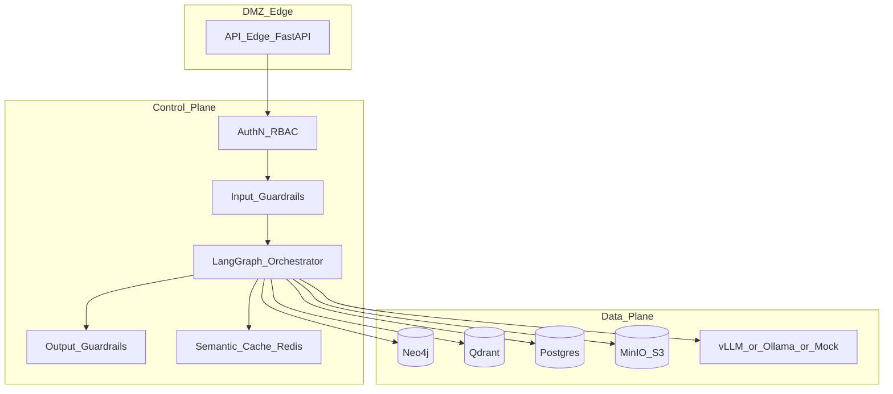

# C4 Level 2 — Контейнеры

**Схема (Draw.io):** [c4-container.png](../../diagrams/c4-container.png) · [c4-container.drawio](../../diagrams/c4-container.drawio)

## Назначение

Микросервисная (контейнерная) декомпозиция: **Control Plane** (auth, guards, оркестратор) отделён от **Data Plane** (БД, объектное хранилище, LLM Serving). Сети compose: `edge` / `control` / `data`.

## Контейнеры

| Контейнер | Ответственность |
| --------- | --------------- |
| API Edge (FastAPI) | Ingress, OpenAPI, SSE |
| AuthN / RBAC | Роли и проверка токена (демо) |
| Input / Output Guardrails | Injection, PII, ACL leak |
| LangGraph Orchestrator | Stateful agent loop |
| Semantic Cache (Redis) | Кэш ответов после Output Guard |
| Neo4j / Qdrant / Postgres / MinIO | Graph, vectors, audit, blobs |
| vLLM / Ollama / MOCK | On-prem LLM Serving |

См. [ADR-004](../adr/ADR-004-orchestration.md), [ADR-005](../adr/ADR-005-security.md).
