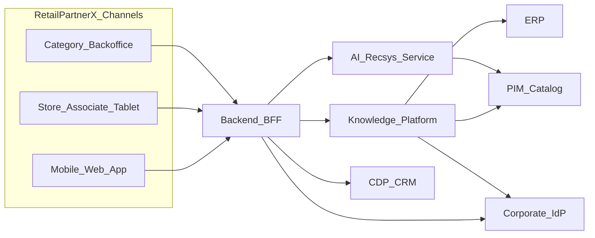

# C4 Level 1 — System Context

RetailPartnerX Knowledge Platform sits inside the retail enterprise landscape.

**Trust boundary:** BFF calls Knowledge Platform via OpenAPI only (`/v1/chat`, `/v1/vision/label`). ML internals are not exposed to channels.