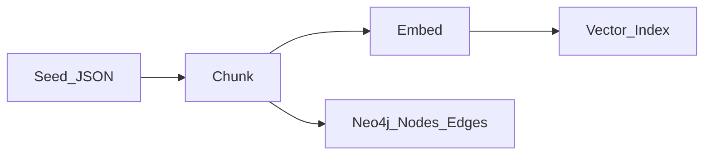
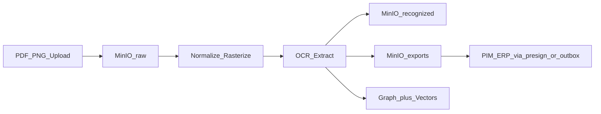

# Data Flow — потоки данных

**Схема (Draw.io):** [data-flow.png](../../diagrams/data-flow.png) · [data-flow.drawio](../../diagrams/data-flow.drawio)

> Обязательный артефакт по критериям курса (анти-reject: «нет Data Flow»).

## Text ingest (политики / KB)

Seed JSON (в т.ч. RU law sample) → chunk → embed → Vector Index; параллельно узлы/рёбра в Neo4j (и in-memory mirror для MVP runtime).

## Label ingest + handoff

Upload PDF/PNG → MinIO `raw/` → normalize/rasterize → OCR extract → `recognized/` + `exports/` → Graph + Vectors → PIM/ERP через presign / outbox `label.recognized`.

## Chat query path (кратко)

Request → Input Guard → (Semantic Cache) → Graph resolve → Vector+ACL → LLM → Output Guard → Audit → SSE/JSON.

См. [sequence-chat.md](sequence-chat.md).
