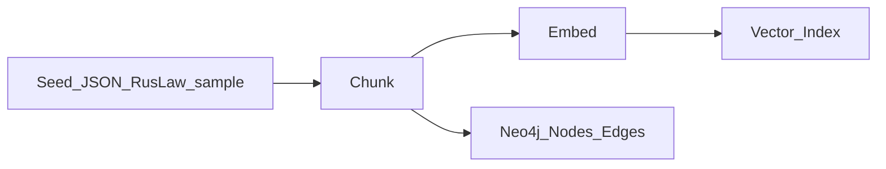
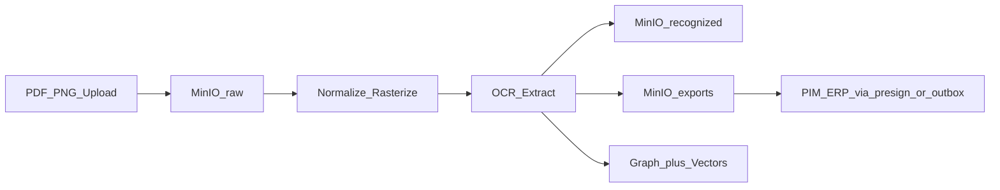

# Data Flow

## Text ingest

```mermaid
flowchart LR
  Seed[Seed_JSON_RusLaw_sample] --> Chunk[Chunk]
  Chunk --> Embed[Embed]
  Embed --> Vec[Vector_Index]
  Chunk --> Graph[Neo4j_Nodes_Edges]
```

## Label ingest + handoff

```mermaid
flowchart LR
  Upload[PDF_PNG_Upload] --> Raw[MinIO_raw]
  Raw --> Norm[Normalize_Rasterize]
  Norm --> Rec[OCR_Extract]
  Rec --> RecS3[MinIO_recognized]
  Rec --> Exp[MinIO_exports]
  Rec --> Graph[Graph_plus_Vectors]
  Exp --> PIM[PIM_ERP_via_presign_or_outbox]
```