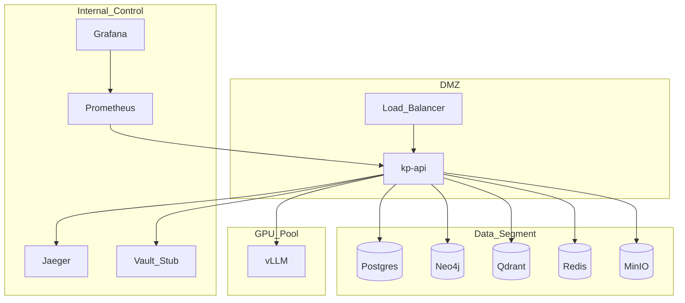

# Deployment — физическое размещение

**Схема (Draw.io):** [deployment.png](../../diagrams/deployment.png) · [deployment.drawio](../../diagrams/deployment.drawio)

## Назначение

Сегментация сети (DMZ / Internal Control / Data / GPU), балансировка, секреты, учёт GPU для on-prem LLM.

## Сегменты

| Сегмент | Состав |
| ------- | ------ |
| DMZ / Edge | Load Balancer → `kp-api` |
| Internal Control | Prometheus, Grafana, Jaeger, Vault (stub) |
| Data | Postgres, Neo4j, Qdrant, Redis, MinIO |
| GPU Pool | vLLM (опциональный compose profile) |

## Секреты и GPU

- **Secrets:** Vault file stub / env — никогда в образах.
- **GPU:** consumer GPU → квантование AWQ/GGUF ([ADR-001](../adr/ADR-001-llm-serving.md)). Без GPU — Ollama small / MOCK.

K8s (Docker Desktop / kind): [../infra/k8s-architecture.md](../infra/k8s-architecture.md).
