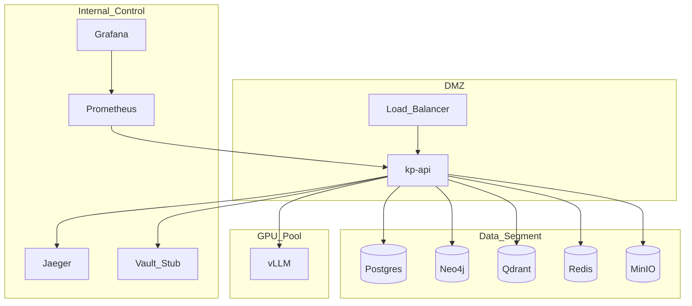

# Deployment Diagram

```mermaid
flowchart TB
  subgraph dmz [DMZ]
    LB[Load_Balancer]
    API[kp-api]
  end
  subgraph internal [Internal_Control]
    Prom[Prometheus]
    Graf[Grafana]
    Jaeger[Jaeger]
    Vault[Vault_Stub]
  end
  subgraph dataplane [Data_Segment]
    PG[(Postgres)]
    N4[(Neo4j)]
    QD[(Qdrant)]
    RD[(Redis)]
    S3[(MinIO)]
  end
  subgraph gpu [GPU_Pool]
    vLLM[vLLM]
  end
  LB --> API
  API --> PG
  API --> N4
  API --> QD
  API --> RD
  API --> S3
  API --> vLLM
  API --> Jaeger
  Prom --> API
  Graf --> Prom
  API --> Vault
```

**Secrets:** Vault file stub / env — never in images.  
**GPU:** optional compose profile `llm`. Consumer GPU → AWQ/GGUF quantization (ADR-001).