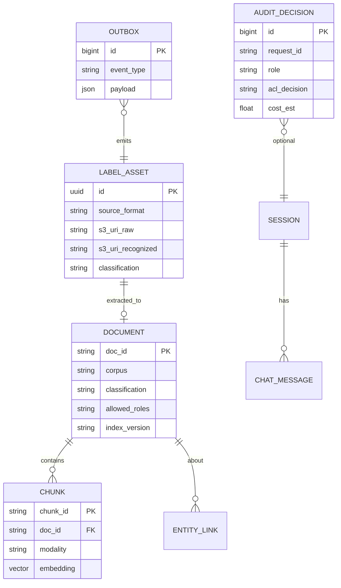

# ER / Data Model

```mermaid
erDiagram
  DOCUMENT ||--o{ CHUNK : contains
  DOCUMENT ||--o{ ENTITY_LINK : about
  LABEL_ASSET ||--o| DOCUMENT : extracted_to
  SESSION ||--o{ CHAT_MESSAGE : has
  AUDIT_DECISION }o--|| SESSION : optional
  OUTBOX }o--|| LABEL_ASSET : emits

  DOCUMENT {
    string doc_id PK
    string corpus
    string classification
    string allowed_roles
    string index_version
  }
  CHUNK {
    string chunk_id PK
    string doc_id FK
    string modality
    vector embedding
  }
  LABEL_ASSET {
    uuid id PK
    string source_format
    string s3_uri_raw
    string s3_uri_recognized
    string classification
  }
  AUDIT_DECISION {
    bigint id PK
    string request_id
    string role
    string acl_decision
    float cost_est
  }
  OUTBOX {
    bigint id PK
    string event_type
    json payload
  }
```