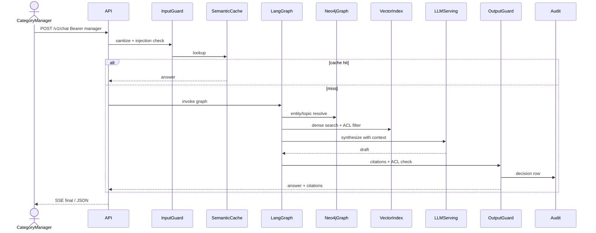

# Sequence — сложный chat-запрос

**Схема (Draw.io):** [sequence-chat.png](../../diagrams/sequence-chat.png) · [sequence-chat.drawio](../../diagrams/sequence-chat.drawio)

## Назначение

Флоу: User → Guardrails → (cache) → Agent Loop (graph resolve → vector + ACL → LLM) → Output Guard → Response. Соответствует требованию курса Sequence Diagram.

## ACL-deny (критичный сценарий)

Если роль `category_manager` запрашивает секретный promo: vector/graph retrieve **не возвращает** secret-чанки; Output Guard дополнительно блокирует утечку маркеров вроде `42%`. Роль `compliance_officer` получает citations по secret.

