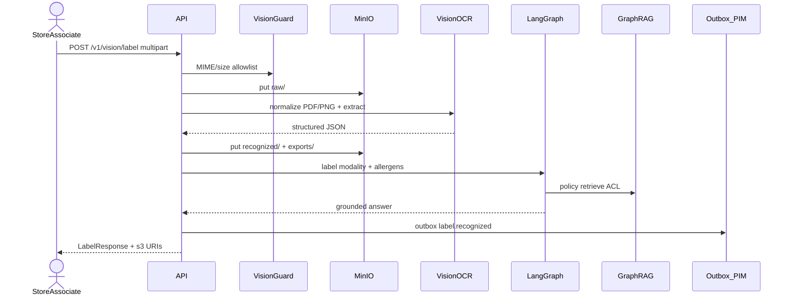

# Sequence — Label Recognition (PDF/PNG)

```mermaid
sequenceDiagram
  actor A as StoreAssociate
  participant GW as API
  participant VG as VisionGuard
  participant S3 as MinIO
  participant OCR as VisionOCR
  participant Orch as LangGraph
  participant G as GraphRAG
  participant PIM as Outbox_PIM

  A->>GW: POST /v1/vision/label multipart
  GW->>VG: MIME/size allowlist
  GW->>S3: put raw/
  GW->>OCR: normalize PDF/PNG + extract
  OCR-->>GW: structured JSON
  GW->>S3: put recognized/ + exports/
  GW->>Orch: label modality + allergens
  Orch->>G: policy retrieve ACL
  Orch-->>GW: grounded answer
  GW->>PIM: outbox label.recognized
  GW-->>A: LabelResponse + s3 URIs
```