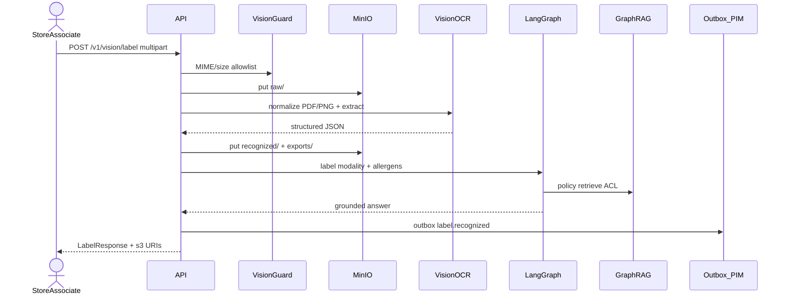

# Sequence — распознавание этикетки (PDF/PNG)

## Назначение

Мультимодальный путь: upload → MIME guard → MinIO raw → OCR/VLM → recognized/exports → GraphRAG policy_check → outbox для PIM/ERP.

См. [ADR-007](../adr/ADR-007-multimodal-labels.md), [data-flow.md](data-flow.md).
