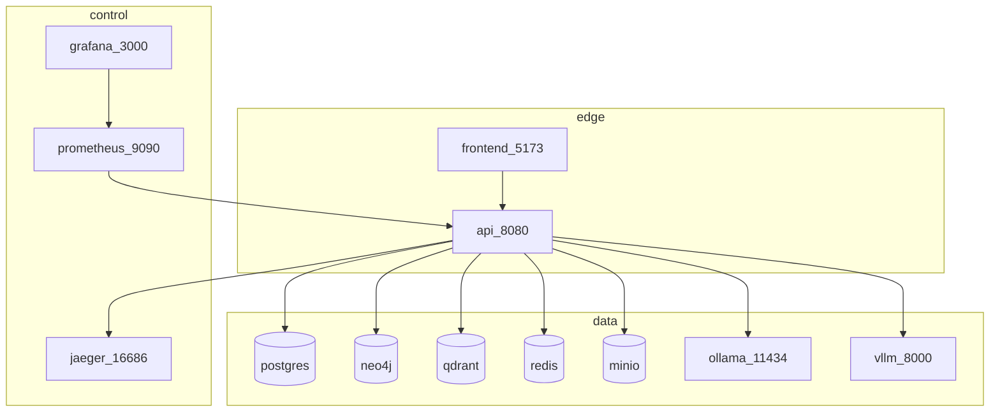

# Compose — дев-среда инфры

**Схема:** [compose-topology.png](../../diagrams/compose-topology.png) · [compose-topology.drawio](../../diagrams/compose-topology.drawio)

Источник правды: [`infra/docker-compose.yml`](../../infra/docker-compose.yml), [`Makefile`](../../Makefile).  
Запуск: [SETUP.md](../SETUP.md) · команды: [SRE.md](../SRE.md).

Project name Compose: `retailpartnerx-kp`.

## Networks (planes)

| Network | Назначение | Кто подключён |
|---------|------------|---------------|
| `edge` | UI ↔ API | `frontend`, `api` |
| `control` | Observability | `jaeger`, `prometheus`, `grafana`, `api` |
| `data` | Stores + LLM | `postgres`, `neo4j`, `qdrant`, `redis`, `minio`, `ollama`, `vllm`, `seed`, `api` |

`api` стоит на всех трёх сетях — единственный мост edge ↔ control ↔ data.

## Profiles и Makefile

| Profile | Сервисы |
|---------|---------|
| `core` | postgres, neo4j, qdrant, redis, minio, jaeger, prometheus, grafana, api, frontend |
| `demo` | всё из `core` + `seed` |
| `llm` | только `ollama` |
| `llm-gpu` | только `vllm` |

| Target | Действие |
|--------|----------|
| `make demo` | `--profile demo` up -d --build |
| `make up` | `--profile core` |
| `make obs` | prometheus, grafana, minio, jaeger (profile `core`) |
| `make llm-ollama` | profile `llm` + pull `qwen2.5:0.5b` |
| `make llm-vllm` | demo + profile `llm-gpu` (NVIDIA) |
| `make down` | down **-v** по всем профилям |

## Сервисы

| Сервис | Порт(ы) | Volume | Профиль | Назначение |
|--------|---------|--------|---------|------------|
| `frontend` | **5173**→80 | — | core/demo | UI (nginx) |
| `api` | **8080** | — | core/demo | FastAPI / GraphRAG |
| `postgres` | **5432** | `pg_data` | core/demo | метаданные / audit |
| `neo4j` | **7474**, **7687** | `neo4j_data` | core/demo | knowledge graph |
| `qdrant` | **6333**, **6334** | `qdrant_data` | core/demo | vectors |
| `redis` | **6379** | `redis_data` | core/demo | cache |
| `minio` | **9000**, **9001** | `minio_data` | core/demo | S3 labels |
| `jaeger` | **16686**, 4317/4318 | — | core/demo | traces |
| `prometheus` | **9090** | config mount | core/demo | metrics |
| `grafana` | **3000** | provisioning | core/demo | dashboards |
| `seed` | — | — | **demo** | one-shot seed KB |
| `ollama` | **11434** | `ollama_data` | **llm** | local LLM (`mem_limit: 3g`) |
| `vllm` | **8000** | — | **llm-gpu** | GPU inference |

Defaults API: `LLM_PROVIDER=MOCK`, `STORE_BACKEND=live` (MinIO bucket `knowledge-platform`).

Creds (dev): Neo4j `neo4j` / `retailpartnerx`, Postgres `kp` / `kp`, MinIO / Grafana admin — см. SETUP.

## Топология (Mermaid)

LLM (`ollama` / `vllm`) поднимаются **отдельными** профилями и не входят в `make demo` по умолчанию.

## Hybrid с Kubernetes

На ноутбуке типичный режим: **API + stores в K8s**, **Ollama в Compose**:

1. `make llm-ollama` → контейнер на `:11434`
2. Helm overlay `values-desktop-compose-ollama.yaml` → API ходит на `http://host.docker.internal:11434/v1`

Подробности: [k8s-architecture.md](k8s-architecture.md) · ops: [SRE.md](../SRE.md).
