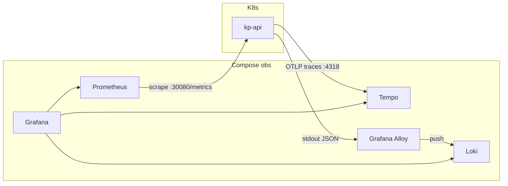

# Compose — hybrid side-stack

**Схема:** [compose-topology.png](../../architecture/diagrams/compose-topology.png) · [compose-topology.drawio](../../architecture/diagrams/compose-topology.drawio)

Источник: [`app/infra/docker-compose.yml`](../../app/infra/docker-compose.yml), [`Makefile`](../../Makefile).  
Запуск: [SETUP.md](../SETUP.md) · ops: [SRE.md](../SRE.md) · ADR: [ADR-006](../../architecture/adr/ADR-006-observability.md).

Project: `retailpartnerx-kp`.

## Правило zero-overlap

| Слой | Где |
|------|-----|
| Platform (api, frontend, postgres, neo4j, qdrant, redis, **minio**) | **только Kubernetes** |
| LLM (**ollama**) | **только Compose** |
| Observability (prometheus, grafana, tempo, loki, alloy) | **только Compose** |

## Profiles

| Profile | Сервисы |
|---------|---------|
| `obs` | tempo, loki, alloy, prometheus, grafana |
| `llm` | ollama |

Сканеры безопасности (отдельный файл, ephemeral): [sec-ops.md](sec-ops.md) · `make sec-scan` · [`docker-compose.sec-ops.yml`](../../app/infra/docker-compose.sec-ops.yml).

| Target | Windows | macOS |
|--------|---------|-------|
| Hybrid up | `.\app\scripts\hybrid\hybrid-up.ps1` | `bash app/scripts/hybrid/hybrid-up.sh` |
| `llm` + `obs` | `docker compose -f app/infra/docker-compose.yml --profile llm --profile obs up -d` | то же |
| Sec scanners | `.\app\scripts\sec\sec-scan.ps1` | `bash app/scripts/sec/sec-scan.sh` |

## Порты (Compose)

| Сервис | Порт |
|--------|------|
| ollama | **11434** |
| tempo | **3200**, OTLP **4317/4318** |
| loki | **3100** |
| alloy | 12345 (UI) |
| prometheus | **9090** |
| grafana | **3000** |

Prometheus scrape (hybrid): `host.docker.internal:30080/metrics` (API NodePort).

Grafana provisioning: `app/infra/grafana/provisioning/` → datasources Prometheus + Tempo + Loki + dashboard **KP Overview** (folder Knowledge Platform).

## LGTM flow


```mermaid
flowchart LR
  subgraph k8s [K8s]
    API[kp-api]
  end
  subgraph compose [Compose obs]
    Tempo[Tempo]
    Loki[Loki]
    Prom[Prometheus]
    Graf[Grafana]
    Alloy[Grafana Alloy]
  end
  API -->|"OTLP traces :4318"| Tempo
  API -->|"stdout JSON"| Alloy
  Alloy -->|push| Loki
  Prom -->|scrape :30080/metrics| API
  Graf --> Prom
  Graf --> Tempo
  Graf --> Loki
```

## Hybrid flow

**Windows**

```powershell
.\app\scripts\hybrid\hybrid-up.ps1
# или: make demo
```

**macOS**

```bash
bash app/scripts/hybrid/hybrid-up.sh
# или: make demo
```

API в K8s → Ollama: `http://host.docker.internal:11434/v1`  
API → Tempo: `http://host.docker.internal:4318` (OTLP/HTTP, Helm env).  
Logs → Loki через Alloy (Docker socket + JSON stdout).

После chat: Grafana Explore → Tempo service `kp-api`, Loki по `trace_id`, panels **KP Overview** (requests / RAG p95 / tokens).

Подробности K8s: [k8s-architecture.md](k8s-architecture.md).
