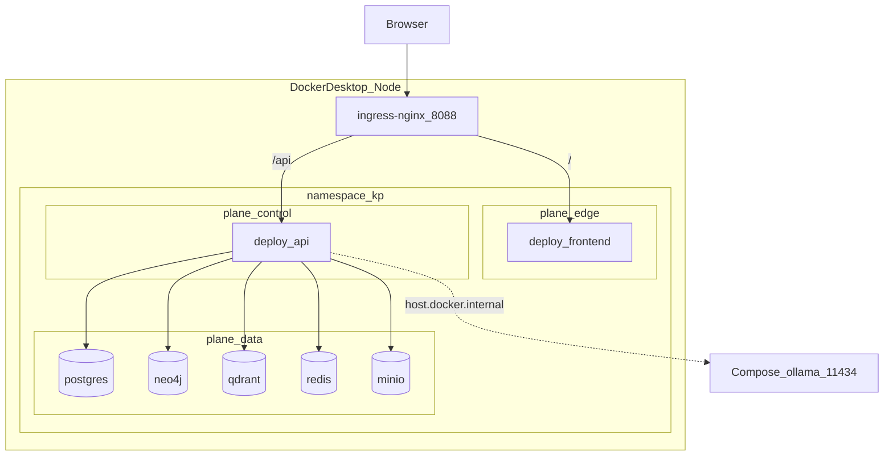

# Kubernetes — архитектура (Docker Desktop + Helm)

**Схема:** [k8s-topology.png](../../diagrams/k8s-topology.png) · [k8s-topology.drawio](../../diagrams/k8s-topology.drawio)

Источник правды: Helm chart [`infra/helm/knowledge-platform/`](../../infra/helm/knowledge-platform/), [`scripts/k8s-up.ps1`](../../scripts/k8s-up.ps1).  
Запуск: [SETUP.md](../SETUP.md) · ops: [SRE.md](../SRE.md).  
Логические сегменты: [architecture/deployment.md](../architecture/deployment.md).

## Nodes

| Режим | Как | Ноды |
|-------|-----|------|
| **Desktop (default)** | `kubectl` context `docker-desktop` | Одна нода Docker Desktop Kubernetes |
| **Legacy kind** | `$env:KP_K8S='kind'` | Кластер `retailpartnerx-kp`: 1× control-plane, label `ingress-ready=true`, hostPort `8088→80` / `8443→443` ([`infra/kind/kind-config.yaml`](../../infra/kind/kind-config.yaml)) |

В chart **нет** nodeSelector / affinity / taints — все поды на единственной ноде ноутбука.

## Namespace и labels

| Ресурс | Значение |
|--------|----------|
| Namespace | `kp` |
| Helm release | `kp` |
| Common labels | `app.kubernetes.io/name=knowledge-platform`, `part-of=retailpartnerx-kp` |
| Plane label | `kp.retailpartnerx.io/plane` |

| Plane | Deployments |
|-------|-------------|
| `edge` | `frontend` |
| `control` | `api` |
| `data` | `postgres`, `neo4j`, `qdrant`, `redis`, `minio`, optional `ollama` |
| `mixed` | label на Namespace `kp` |

## Pods и Services (desktop default)

По умолчанию **7 подов** (Ollama выключен в [`values-desktop.yaml`](../../infra/helm/knowledge-platform/values-desktop.yaml)):

| Deployment | Service | Port(s) | Replicas | Plane | Resources (requests) |
|------------|---------|---------|----------|-------|----------------------|
| `api` | `api` | 8080 | 1 | control | cpu 100m, mem 256Mi |
| `frontend` | `frontend` | 80 | 1 | edge | cpu 50m, mem 64Mi |
| `postgres` | `postgres` | 5432 | 1 | data | — |
| `neo4j` | `neo4j` | 7474, 7687 | 1 | data | — |
| `qdrant` | `qdrant` | 6333 | 1 | data | — |
| `redis` | `redis` | 6379 | 1 | data | — |
| `minio` | `minio` | 9000, 9001 | 1 | data | — |
| `ollama` *(opt)* | `ollama` | 11434 | 1 | data | cpu 500m, mem 2Gi |

Другие ресурсы chart:

- Secret `kp-secrets`
- Ingress `kp-api`, `kp-ui`
- Images: `kp-api:dev`, `kp-frontend:dev` (`pullPolicy: Never` на desktop)

Desktop overlay: `STORE_BACKEND=live`, MinIO on, `LLM_PROVIDER=MOCK`, `llm.ollama.enabled=false`.

## Ingress

| Ingress | Path | Backend |
|---------|------|---------|
| `kp-ui` | `/` | `frontend:80` |
| `kp-api` | `/api(/|$)(.*)` → rewrite `/$2` | `api:8080` |

- Host: `kp.local`
- Class: `nginx`
- Host access: ingress-nginx LoadBalancer на **:8088** / **:8443** (Windows `:80` часто занят IIS)
- Annotations: body size `20m`, buffering off на API

Hosts: `127.0.0.1 kp.local` → UI http://kp.local:8088 · health http://kp.local:8088/api/health

```
Browser → ingress-nginx :8088
          ├─ /        → svc/frontend → deploy/frontend
          └─ /api/... → svc/api      → deploy/api → data-plane Services
```

## Helm values overlays

| File | Роль |
|------|------|
| [`values.yaml`](../../infra/helm/knowledge-platform/values.yaml) | База: MOCK LLM, все stores on, replicas=1 |
| [`values-desktop.yaml`](../../infra/helm/knowledge-platform/values-desktop.yaml) | Desktop: `pullPolicy: Never`, live MinIO, Ollama **off** |
| [`values-desktop-compose-ollama.yaml`](../../infra/helm/knowledge-platform/values-desktop-compose-ollama.yaml) | Hybrid: `OLLAMA` → `http://host.docker.internal:11434/v1`, model `qwen2.5:0.5b` |
| [`values-ollama.yaml`](../../infra/helm/knowledge-platform/values-ollama.yaml) | In-cluster Ollama (`ollama.enabled: true`) |

`k8s-up.ps1` + `$env:KP_LLM`:

| `KP_LLM` | Overlay |
|----------|---------|
| unset | desktop + MOCK |
| `compose-ollama` | + compose-ollama overlay |
| `ollama` | + in-cluster Ollama |

Скрипт: build images → install ingress-nginx (desktop) → `helm upgrade --install kp ... -n kp --create-namespace --wait`.  
Снос: `.\scripts\k8s-down.ps1` (desktop оставляет shared ingress-nginx).

## Что не в Helm

| Компонент | Где |
|-----------|-----|
| Prometheus / Grafana / Jaeger | Compose (`make obs` / `make demo`) |
| Ollama (рекомендуется) | Compose profile `llm` |
| vLLM | Compose profile `llm-gpu` |

Frontend **никогда** не ходит в Ollama напрямую — только через API (`/v1/chat`, `/v1/llm/*`).

## Топология (Mermaid)



## Templates chart

| Template | Содержимое |
|----------|------------|
| `namespace.yaml` | Namespace `kp` |
| `api.yaml` / `frontend.yaml` | Control / edge Deployments + Services |
| `data-plane.yaml` | postgres, neo4j, qdrant, redis, minio |
| `ollama.yaml` | optional LLM pod |
| `ingress.yaml` | `kp-api`, `kp-ui` |
| `secret.yaml` | `kp-secrets` |
